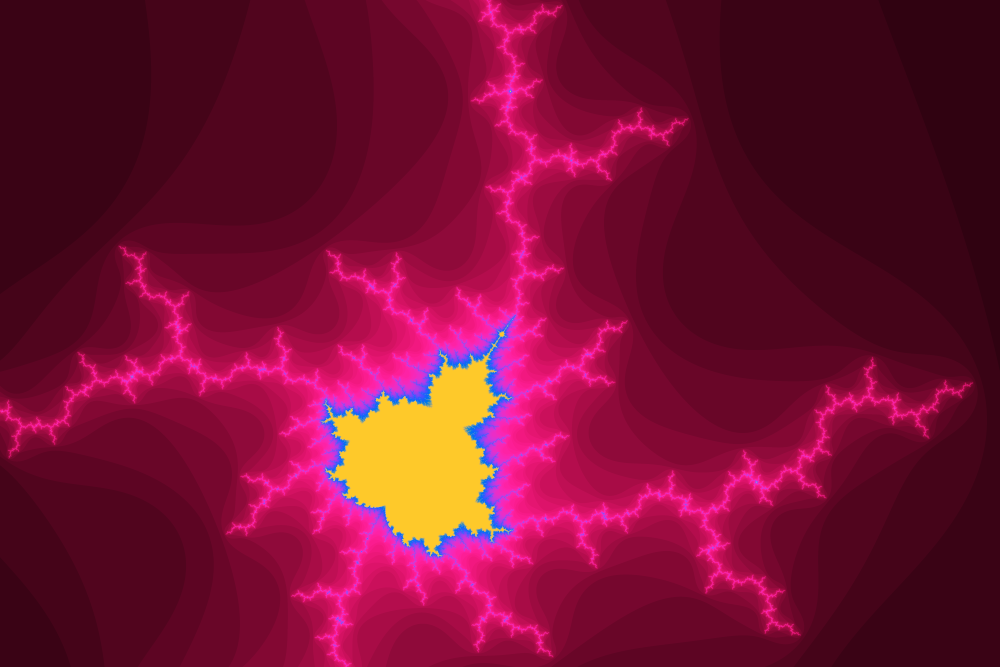
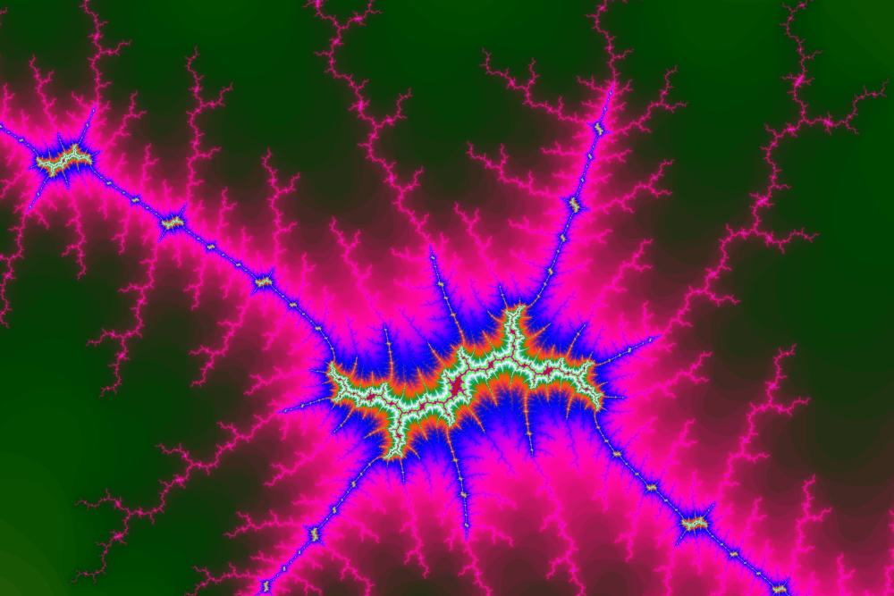

# Mandelbrot Set Visualiser 


Simple app for zooming into the
<a href="https://en.wikipedia.org/wiki/Mandelbrot_set">mandelbrot set</a>.<br>
Here are some examples:


**Zoomed twice** <br>
<br>


**Zoomed a hundred times** <br>
<br>


**Zoomed a million times** <br>
<br>


**Zoomed a trillion times** <br>
<br>


<br>

The set is colored using this equation:


[comment]: <> (```math)
[comment]: <> (&#40;r, g, b&#41; = \frac{255}{2K} * &#40;1 - cos&#40;R * n&#41;, 1 - cos&#40;G * n&#41;, 1 - cos&#40;B * n&#41;&#41;)
[comment]: <> (```)
where n is the number of iterations and K, R, G, B are chosen parameters,
initialized as:


<br>
<br>
<br>
<br>

I found the equation 
<a href="https://www.math.univ-toulouse.fr/~cheritat/wiki-draw/index.php/Mandelbrot_set">here</a>,
where the math is explained more thoroughly, if anyone is interested.


[comment]: <> (```math)
[comment]: <> (R = 1)
[comment]: <> (G = \frac{1}{3\sqrt{2}})
[comment]: <> (B = \frac{1}{7 \cdot 3^{1/8}})
[comment]: <> (```)

## How to use

<table>
    <tr>
        <th>Control</th>
        <th>Action</th>
        <th>Notes</th>
    </tr>
    <tr>
        <td>w</td>
        <td>move up</td>
        <td></td>
    </tr>
    <tr>
        <td>s</td>
        <td>move down</td>
        <td></td>
    </tr>
    <tr>
        <td>a</td>
        <td>move left</td>
        <td></td>
    </tr>
    <tr>
        <td>d</td>
        <td>move right</td>
        <td></td>
    </tr>
    <tr>
        <td>j</td>
        <td>zoom in</td>
        <td>Press shift for faster zooming.</td>
    </tr>
    <tr>
        <td>k</td>
        <td>zoom out</td>
        <td>Press shift for faster zooming.</td>
    </tr>
    <tr>
        <td>h</td>
        <td>decrease number of iterations</td>
        <td>-5</td>
    </tr>
    <tr>
        <td>l</td>
        <td>increase number of iterations</td>
        <td>+5</td>
    </tr>
    <tr>
        <td>b</td>
        <td>zoom_value back to initial state</td>
        <td>It keeps the position, just resets the zoom_value,
            so you can zoom_value in again to where you were.</td>
    </tr>
    <tr>
        <td>r</td>
        <td>zoom_value back and reset all parameters</td>
        <td>
            Zooms back to the original state
            and also keeps the position. In addition,
            it resets the value of maximum iterations.
        </td>
    </tr>
    <tr>
        <td>c</td>
        <td>color reset</td>
        <td>Resets K, R, G and B constants to theirs default values.</td>
    </tr>
    <tr>
        <td>u</td>
        <td>K = K + 1</td>
        <td>Press shift for decrease.
            Press ctrl for slower change</td>
    </tr>
    <tr>
        <td>i</td>
        <td>R = R + 0.1</td>
        <td>Press shift for decrease.
            Press ctrl for slower change</td>
    </tr>
    <tr>
        <td>o</td>
        <td>R = R + 0.1</td>
        <td>Press shift for decrease.
            Press ctrl for slower change</td>
    </tr>
    <tr>
        <td>p</td>
        <td>R = R + 0.1</td>
        <td>Press shift for decrease.
            Press ctrl for slower change</td>
    </tr>
    <tr>
        <td>enter</td>
        <td>capture</td>
        <td>Saves the current part of the set as a .ppm image in 8K.
        </td>
    </tr>
</table>

## Building the app
There are two options as for how to build this app. You can compile the source code
for gpu or for cpu. Performance of the gpu version is much higher, but it only allows me to
use less precise numerical types, so the maximum zoom_value is lower. <br>
The performance of cpu version is much worse, but it allows larger zoom_value.

To build the app, simply use the provided makefile and type `make` or `make ACC=gpu`.


## Running the app
The compiled app can be run as is, then the size of the window will be 1200x800.
You can also pass different size as command line argument in the form of
``
$ ./mandelbrot WIDTH HEIGHT
``
but be aware of keeping the correct ratio 3 : 2.
If you don't want to care about the ratio,
you can omit the HEIGHT parameter, it will be automatically computed
from WIDTH.

