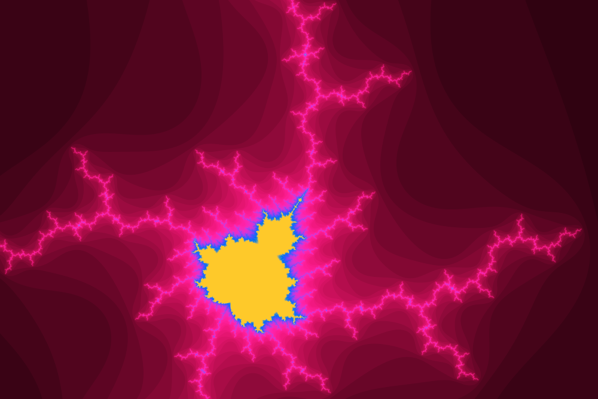
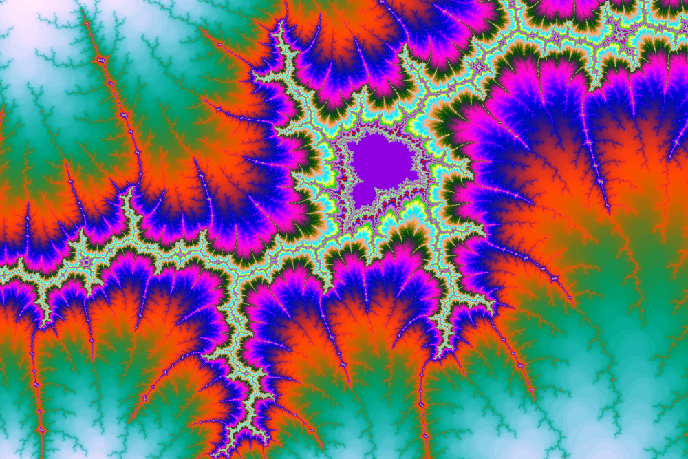
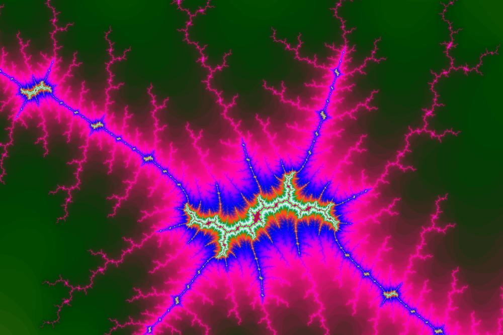

# Fractals Zooming Visualizer


Simple app for zooming into [Mandelbrot Set](https://en.wikipedia.org/wiki/Mandelbrot_set).

Here are some screenshots:

No zoom


**Zoomed a hundred times**



**Zoomed a million times**



**Zoomed a trillion times**



The fractal is colored using this formula:


where n is the number of computed iterations before the point exceeded
from the set and K, R, G, B are parameters, initialized as:


<br>
<br>
<br>
<br>

For the formula I was inspired
by [this article](https://www.math.univ-toulouse.fr/~cheritat/wiki-draw/index.php/Mandelbrot_set).

## How to use

<table>
  <tr>
    <th>Control</th>
    <th>Action</th>
    <th>Notes</th>
  </tr>
  <tr>
    <td>w, up</td>
    <td>move up</td>
    <td></td>
  </tr>
  <tr>
    <td>s, down</td>
    <td>move down</td>
    <td></td>
  </tr>
  <tr>
    <td>a, left</td>
    <td>move left</td>
    <td></td>
  </tr>
  <tr>
    <td>d, right</td>
    <td>move right</td>
    <td></td>
  </tr>
  <tr>
    <td>j</td>
    <td>zoom in</td>
    <td>Press shift for faster zooming.</td>
  </tr>
  <tr>
    <td>k</td>
    <td>zoom out</td>
    <td>Press shift for faster zooming.</td>
  </tr>
  <tr>
    <td>h</td>
    <td>decrease number of iterations</td>
    <td>-5</td>
  </tr>
  <tr>
    <td>l</td>
    <td>increase number of iterations</td>
    <td>+5</td>
  </tr>
  <tr>
    <td>b</td>
    <td>zooms back to initial state</td>
    <td>It keeps the position and number of maximum iterations, just resets the zoom,
        so you can zoom in again to where you were before as long as you won't move.</td>
  </tr>
  <tr>
    <td>r</td>
    <td>zooms back and reset the number of iterations</td>
    <td>
        Zooms back to the original state
        and also keeps the position. In addition,
        it resets the value of maximum iterations.
    </td>
  </tr>
  <tr>
    <td>c</td>
    <td>color reset</td>
    <td>Resets K, R, G and B constants to theirs default values.</td>
  </tr>
  <tr>
    <td>1</td>
    <td>K = K + 0.5</td>
    <td>Press shift for faster change.
        Press ctrl for decrease</td>
  </tr>
  <tr>
    <td>2</td>
    <td>R = R + 0.05</td>
    <td>Press shift for faster change.
        Press ctrl for decrease</td>
  </tr>
  <tr>
    <td>3</td>
    <td>G = G + 0.05</td>
    <td>Press shift for faster change.
        Press ctrl for decrease</td>
  </tr>
  <tr>
    <td>4</td>
    <td>B = B + 0.05</td>
    <td>Press shift for faster change.
        Press ctrl for decrease</td>
  </tr>
  <tr>
    <td>t</td>
    <td>toggle info</td>
    <td></td>
  </tr>
  <tr>
    <td>enter</td>
    <td>capture</td>
    <td>Saves the current part of the set as a .ppm image in 8K.
    </td>
  </tr>
</table>

You can also move around using mouse.


## Building the app (for Linux)
To build the app, simply use the provided makefile and run `make`.
The command will create build directory with the Mandelbrot
executable in it.
For the compilation to work, one must have installed `pgc++` compiler.
Installation instructions are [here](https://developer.nvidia.com/nvidia-hpc-sdk-downloads).


To build the app, you alse need [SFML library](https://www.sfml-dev.org/).
It should be possible to get it easily from your system's repositories.


## Usage

The default width is set to 1200 px, which is enough to look good,
but not too much to run too slow. You can change the width using a command line argument.
The height is computed automatically as two thirds of the width to maintain the correct ratio.

```
Mandelbrot [<width>]
```
